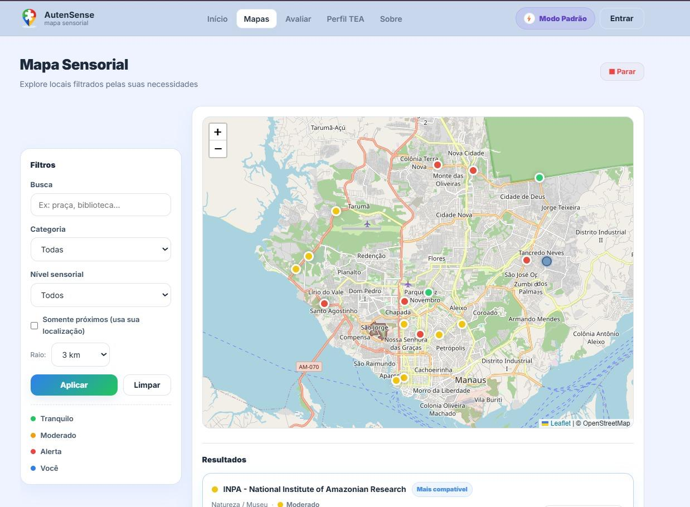

# AutenSense

O AutenSense é um sistema inteligente de mapeamento sensorial urbano inclusivo que busca identificar e registrar características sensoriais de diferentes espaços da cidade, como níveis de ruído, iluminação e fluxo de pessoas. A plataforma utiliza tecnologia e geolocalização para permitir que usuários contribuam de forma colaborativa com informações sobre esses ambientes.

